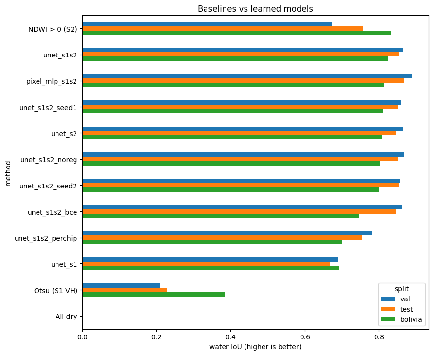
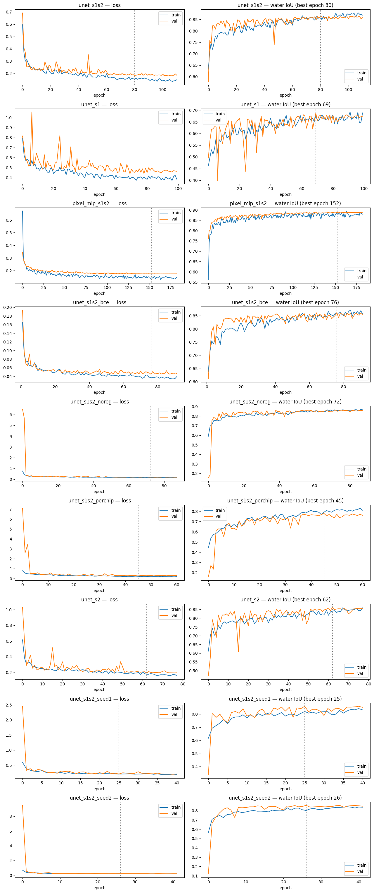
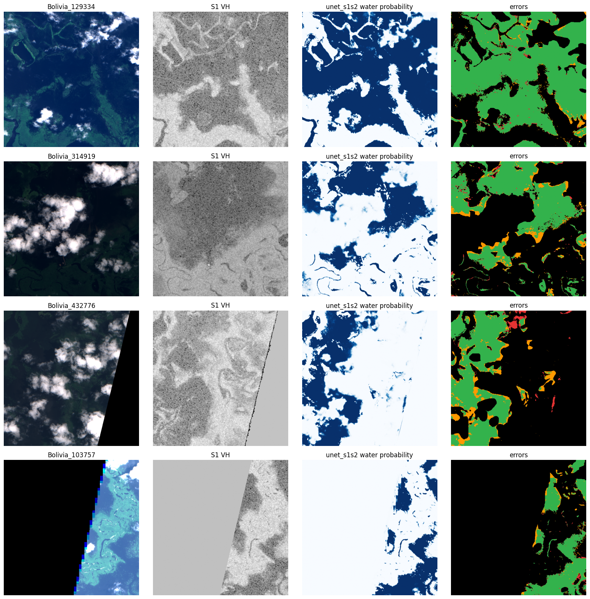
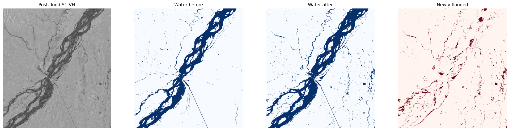

# Flood Extent Segmentation from Sentinel Satellite Imagery

**DATAX504 Practical Machine Learning: final project report**
Rishav Pandey (1716081) · Course Convenor: Jason Kurz
Code: https://github.com/RishavvP/DATAX504-Rishav/tree/main/final-project/nepal-flood-segmentation

---

## 1. Introduction and related work

Floods are among the most frequent and damaging natural disasters, and in South Asia they arrive with the monsoon, under heavy cloud.
Satellite imagery is often the fastest evidence of where water has spread. This project builds **automatic, pixel-level flood maps** from Sentinel imagery
and asks a practical question: **when only a few hundred hand-labelled examples exist, which deep learning design choices matter most?**
The trained model is then applied to a real flood in **Nepal** that it has never seen.

The task is **binary semantic segmentation**: for every 10 m pixel, predict *water* or *not water*.

**Related work.**
* *Radar thresholding.* Calm water reflects radar away from the satellite, so it appears dark in Sentinel-1 (S1) imagery. The classic approach picks a
  backscatter threshold, often automatically with Otsu's method (Otsu, 1979). This is the core of operational chains such as Twele et al. (2016).
* *Optical water indices.* On clear days, the Normalised Difference Water Index, NDWI = (Green − NIR)/(Green + NIR), separates water from land in
  Sentinel-2 (S2) imagery (McFeeters, 1996).
* *Deep learning.* U-Net (Ronneberger et al., 2015) is an encoder–decoder convolutional network with skip connections, designed for segmentation
  with little labelled data. Bonafilia et al. (2020) released **Sen1Floods11**, the dataset used here, together with thresholding and convolutional baselines,
  and proposed holding out the Bolivia flood event as a test of generalisation.

The workflow follows the universal machine-learning workflow of Chollet & Watson (2025, ch. 6): define the problem and metric, beat a common-sense baseline,
develop a model that can overfit, then regularise and evaluate on data never used for decisions.

## 2. Data and preprocessing

| Item | Detail |
|---|---|
| Source | Sen1Floods11 (Bonafilia et al., 2020), public bucket `gs://sen1floods11` |
| Used | The 446 **hand-labelled** 512×512 chips (about 1.75 GB): S1 (VV, VH in dB) and S2 (13 bands), label 1 = water, 0 = dry, −1 = no data |
| Events | USA 69, India 68, Paraguay 67, Ghana 53, Sri Lanka 42, Spain 30, Mekong 30, Pakistan 28, Somalia 26, Nigeria 18, Bolivia 15 |
| Splits | Official split files: **train 252, val 89, test 90** chips (10 events), plus **Bolivia, 15 chips**, held out entirely as an unseen event |
| Class balance | Water is 10.6% of labelled pixels; 13.6% of pixels are unlabelled |
| Nepal | Sentinel-1 IW scenes of the Koshi floodplain from Google Earth Engine (`COPERNICUS/S1_GRD`; Gorelick et al., 2017): 19 Sept 2024 (before) and 1 Oct 2024 (after), same orbit track, 10 m. Used for demonstration only, never for training |

**Choice of metric.** Because water is only 10.6% of pixels, a model that predicts "dry" everywhere scores **87.5% accuracy on test with zero usefulness**.
Models are therefore ranked by **water-class IoU** = TP / (TP + FP + FN), which ignores the easy true negatives. F1, precision and recall are also reported.
The **primary metric is IoU on Bolivia**, because the test split shares flood events with training and so overestimates performance on a new flood.

**Preprocessing.**
* Radar is clipped to [−50, 5] dB, and optical bands are scaled to 0–1 reflectance (raw values ÷ 10,000).
* Each band is standardised with the mean and standard deviation of the **training set only**. Missing pixels become the band mean.
* Unlabelled pixels (−1) are kept in the data but **masked out** of the loss, the metric and the baselines.
* Chips are cached once as float16 NumPy arrays and streamed with `tf.data`. Training uses random 256×256 crops with random 90° rotations and flips,
  applied identically to image and mask.

**Leakage checks.**
* The notebook asserts that no chip appears in both training and validation/test.
* Normalisation statistics come from training chips only.
* The validation set is used for every decision (early stopping, learning-rate schedule, decision threshold). Test and Bolivia are evaluated **once**, at the end.

**Response to the proposal feedback ("another massive data set").** The full dataset is about 14 GB because of 4,385 weakly-labelled chips.
Only the 1.75 GB hand-labelled subset is used (see §8).

**Ethics and licence.** Sen1Floods11 states no explicit licence, so it is used for academic work with citation. Copernicus Sentinel data is free and open.
The imagery contains no personal data. The flood maps are not validated for emergency use and should not inform operational decisions.

## 3. Model architecture and training procedure

**U-Net** (Keras functional API):
* A 4-level encoder of two 3×3 convolutions, batch normalisation and ReLU per level, with max-pooling. Filters double from 32 to 256, then 512 in the bottleneck.
* Spatial dropout 0.3 in the bottleneck.
* A decoder of 2×2 transposed convolutions, with **skip connections** that concatenate the matching encoder features to keep river boundaries sharp.
* A 1×1 sigmoid output giving water probability.
* The network is fully convolutional, so it trains on 256 px crops and predicts on 512 px chips or whole Nepal scenes.

**Per-pixel MLP baseline:** two hidden layers of 64 units, applied to each pixel independently as 1×1 convolutions. It sees a pixel's band values but no neighbourhood,
which isolates what the U-Net's spatial context contributes.

**Loss:** masked binary cross-entropy + Dice loss. BCE gives stable per-pixel gradients, while Dice directly optimises overlap and is not swamped by the 89% dry class.

**Metric:** a custom stateful `keras.metrics.Metric` that accumulates TP/FP/FN over the whole epoch before computing IoU. Averaging per-batch IoU would be biased.

**Training:**
* Adam (lr 1e-3), batch 16, 126 steps per epoch, mixed-precision float16 on a Colab GPU (T4, then L4).
* `ReduceLROnPlateau` halves the learning rate after 10 epochs without validation-loss improvement.
* `EarlyStopping` on validation IoU, with patience 30 for the first three experiments and 15 for the rest (see §8).
* At most 300 epochs.

**Sanity check.** Before full training, a small U-Net was trained on a single batch. Its loss fell from 2.60 to 1.16, confirming that the data, labels and loss are connected correctly.

**Decision threshold:** chosen per model on the validation set (grid 0.20–0.80; chosen values 0.35–0.65), then applied unchanged to test and Bolivia.

**Fault tolerance (response to feedback).**
* Every epoch, `BackupAndRestore` saves the full training state (weights, optimiser and epoch) to Google Drive, and `ModelCheckpoint` keeps the best weights.
* After a disconnect, *Run all* resumes interrupted runs and skips finished ones.

This was exercised for real when the free Colab session was cut off mid-training, and two practical lessons came out of it:
* **Recent epochs can be lost.** With Drive full, the latest checkpoints were not uploaded, and one run resumed from an earlier epoch.
* **Drive reads were unreliable.** Reading 446 chips through Drive caused intermittent read errors, so the dataset was moved to the Colab machine's local disk.

## 4. Experiments

Each experiment changes **one** design choice relative to the reference `unet_s1s2` (all 15 bands, BCE + Dice, dropout + augmentation, training-set normalisation).

| Question | Compare |
|---|---|
| Which sensor? | `unet_s1` (radar), `unet_s2` (optical), `unet_s1s2` (both) |
| Does spatial context matter? | `pixel_mlp_s1s2` vs `unet_s1s2` |
| Loss function | `unet_s1s2_bce` (no Dice) vs `unet_s1s2` |
| Regularisation | `unet_s1s2_noreg` (no dropout, no augmentation) vs `unet_s1s2` |
| Normalisation | `unet_s1s2_perchip` (each image standardised by its own statistics) vs `unet_s1s2` |
| Seed variance | `unet_s1s2` with seeds 42, 1 and 2 |

Baselines: **all dry**, **Otsu on S1 VH** (threshold chosen per chip), and **NDWI > 0** on S2.

## 5. Results

Water IoU. The reference row is the mean ± standard deviation over 3 seeds.

| Method | Val IoU | Test IoU | **Bolivia IoU** | Bolivia F1 | Bolivia precision / recall |
|---|---|---|---|---|---|
| All dry (accuracy: test 87.5%, Bolivia 84.1%) | 0.000 | 0.000 | 0.000 | 0.000 | – |
| Otsu (S1 VH) | 0.210 | 0.229 | 0.384 | 0.555 | 0.41 / 0.87 |
| NDWI > 0 (S2) | 0.672 | 0.758 | **0.832** | 0.908 | 0.93 / 0.89 |
| Pixel MLP (S1+S2) | 0.889 | **0.868** | 0.814 | 0.897 | 0.97 / 0.84 |
| U-Net S1 (radar only) | 0.688 | 0.667 | 0.693 | 0.819 | 0.80 / 0.83 |
| U-Net S2 (optical only) | 0.864 | 0.847 | 0.808 | 0.894 | 0.94 / 0.85 |
| **U-Net S1+S2 (reference, 3 seeds)** | 0.860 ± 0.004 | 0.854 ± 0.001 | 0.812 ± 0.012 | 0.896 ± 0.007 | 0.96 / 0.84 |
| U-Net S1+S2, BCE only (no Dice) | 0.863 | 0.847 | 0.746 | 0.854 | 0.94 / 0.78 |
| U-Net S1+S2, no regularisation | 0.868 | 0.850 | 0.803 | 0.891 | 0.96 / 0.83 |
| U-Net S1+S2, per-chip normalisation | 0.780 | 0.755 | 0.702 | 0.825 | 0.86 / 0.79 |

Reference seeds on Bolivia: 0.825 (seed 42), 0.811 (seed 1), 0.800 (seed 2). Full numbers are in `results/results.csv`.

*Figure 1. Water IoU for every method on validation, test and Bolivia.*

**Success criterion: met.** The proposal's target was to beat Otsu thresholding of S1 VH on the Bolivia hold-out.
* Otsu scores **0.384**. The proposal cited about 0.32 from the dataset paper; our per-chip variant is somewhat higher.
* The radar-only U-Net, using the same input, scores **0.693: +0.31 IoU, or 1.8×**.
* Every learned model beats Otsu by a wide margin.

### Findings

1. **Learned vs classical.**
   * Against radar thresholding, learning wins clearly: +0.44 IoU on test and +0.31 on Bolivia.
   * Against NDWI, the result depends on the split. On test the reference U-Net is **+0.10** better (0.854 vs 0.758).
   * On Bolivia, NDWI (0.832) and the U-Net (0.812 ± 0.012) are **statistically tied**: the gap is under 2 seed standard deviations.
   * NDWI needs no training, so it cannot be hurt by a shift between flood events. Bolivia's large open floodwater is also an easy case for it on clear days.
2. **Sensors.**
   * Optical carries most of the signal: S2 scores 0.808 on Bolivia against 0.693 for S1.
   * Fusing both (0.812) adds nothing measurable over optical alone.
   * Radar still matters in practice because it sees through cloud (§6, §7).
3. **Normalisation is the largest design effect (−0.11 IoU).**
   * Standardising each chip by its own statistics removes absolute brightness, and absolute brightness is what identifies water: dark radar, low near-infrared reflectance.
   * After this change, a chip with a little water looks like a chip that is mostly water.
   * Its learning curve shows the clearest train–validation gap of any run (about 0.82 vs 0.76; Figure 2).
4. **The Dice loss matters for generalisation.**
   * Removing Dice costs **−0.066** on Bolivia, more than 5 seed standard deviations, but almost nothing on test.
   * Without Dice, recall drops (0.78 vs 0.84): plain BCE under-predicts the minority class when the water fraction differs from training.
5. **Spatial context did not help with 15 bands.**
   * The per-pixel MLP matches the U-Net (Bolivia 0.814 vs 0.812) and is slightly better on test (0.868 vs 0.854). With optical bands, water is separable pixel by pixel.
   * This contradicts the proposal's expectation. Context should matter more for radar-only input, where speckle noise needs neighbouring pixels, but that was not tested (§9).
6. **Regularisation made no measurable difference.**
   * Without dropout and augmentation, Bolivia IoU is 0.803 against 0.812 ± 0.012, which is within noise.
   * Its learning curves show training and validation IoU tracking closely. Early stopping and the small model size already prevent overfitting.

*Figure 2. Loss and water IoU per epoch for every experiment (epochs counted from 0). The dotted line marks the best epoch.*

**Generalisation gap.** The reference U-Net drops from 0.854 on test to 0.812 on Bolivia, a gap of **0.042**: a modest loss for an unseen country.
The radar-only U-Net and Otsu both score *higher* on Bolivia than on test, which suggests this particular event is visually easier (large open water)
rather than the models being unusually robust.

## 6. Error analysis

**What kind of errors?** Every U-Net has **high precision and lower recall** on Bolivia (reference: 0.96 vs 0.84). When it says water, it is almost always right,
but it misses about one water pixel in six. Otsu fails the opposite way: it finds most water (recall 0.87) but raises many false alarms (precision 0.41),
because every chip is forced into two classes even when it contains little water.

*Figure 3. The best model on the four Bolivia chips with the most water. Columns: true colour, S1 VH, predicted water probability, errors
(green = correct water, red = false alarm, orange = missed water, black = correct dry or no data).*

**Where it fails, from Figure 3:**
* **Water boundaries.** Most missed water (orange) is a thin band along the edges of flooded areas. This is where mixed land/water pixels and partly submerged vegetation
  sit, and where the hand labels themselves are least certain.
* **Flooded vegetation.** In Bolivia_314919 and Bolivia_432776, whole patches inside the floodplain are missed. Under trees or tall grass, water does not look dark
  to radar or blue to optics, so both sensors under-report it.
* **Cloud.** These chips are heavily clouded in S2, yet the model still maps most of the water. The fused model learned to fall back on radar where optical is blocked.
* **Swath edges.** In Bolivia_432776, a small false alarm (red) sits near the edge of the radar image, where the no-data boundary distorts the signal.
* **Few false alarms overall.** Red patches are rare, which matches the high precision.

**Which inputs fail most?** The radar-only model has the lowest precision of the U-Nets (0.80). Smooth surfaces such as sand bars, roads and calm crop fields are
radar-dark like water, and speckle produces isolated false pixels. Its validation curve is also the noisiest (Figure 2), dropping to 0.40 IoU in some epochs.

## 7. Nepal case study

The radar-only U-Net was applied to two Sentinel-1 scenes of the **Koshi River floodplain, eastern Nepal** (86.80–87.10°E, 26.40–26.70°N, about 1,000 km²).
The scenes were taken on 19 September 2024 (before) and 1 October 2024 (after the 27–28 September floods), from the same orbit track 12 days apart, so the viewing geometry is identical.
The radar model was chosen because monsoon floods happen under cloud.

Subtracting the before map from the after map gives **34.94 km² of newly flooded land**, about 3.5% of the area.

*Figure 4. Koshi River, Nepal. From left: post-flood Sentinel-1 VH, water on 19 Sept, water on 1 Oct, newly flooded area (34.94 km²).*

* **What looks right.** The model traces the braided Koshi channel, the Koshi Barrage crossing at the centre and a straight irrigation canal, even though it never saw Nepal in training.
  After the flood the channel is wider, side channels have filled, and new water sits along the channel margins and low floodplain, where flooding is expected.
* **What to be cautious about.** Some "new water" is small scattered patches away from the river. These are likely speckle, wet soil or waterlogged rice paddies,
  which radar sees as water during the monsoon. The after image was taken about three days after the peak, so some water had probably drained and the peak extent was larger.
  A lowland site was chosen deliberately, to avoid the radar-shadow false alarms expected on steep Himalayan slopes.
* **Limits of the evidence.** There is no ground truth, so this is a qualitative demonstration of transfer, not a measured accuracy.

## 8. Changes from the proposal

| Proposal | What was done | Why |
|---|---|---|
| Pretrain on weakly-labelled chips, then fine-tune | Dropped | About 12 GB more data and many more GPU hours. The proposal's "if time runs short" clause allowed it. Overfitting was handled with augmentation, dropout, early stopping and 3 seeds instead, and the regularisation ablation shows little overfitting |
| Pretrained-encoder variant | Dropped | First item the proposal said to cut |
| Full hyperparameter search | Replaced by one-factor ablations | Ablations answer the proposal's question (which design choice matters) at a fraction of the cost |
| Early-stopping patience 30 | Reduced to 15 after the first three experiments | To fit GPU limits. Replaying the reference model's log shows patience 15 would have picked the identical best epoch (81, val IoU 0.8647). But see the caveat in §9 |
| Per-pixel dense network, three seeds | Done | |

## 9. Limitations

* **Small data.** 446 labelled chips from 11 events. Bolivia is a single 15-chip event, which appears easier than average, so one hold-out event is weak evidence of generalisation.
* **Uneven training length.** Runs trained with patience 15 stopped earlier: the two extra seeds stopped at about epoch 40 (best epochs 25 and 26), while the reference ran to 111.
  The seed spread (±0.012) therefore mixes seed noise with shorter training, and the ablations may be slightly disadvantaged against the reference.
  Their conclusions rest on effects (−0.066, −0.11) much larger than that spread.
* **Single runs.** Only the reference model has repeated seeds. Every other variant is one run.
* **Untested gap.** Spatial context was tested only with all 15 bands. A radar-only pixel MLP would show whether the U-Net's context helps when the per-pixel signal is weak.
* **No terrain information.** Radar shadow on slopes would cause false water in hilly terrain.
* **Nepal is qualitative.** There is no ground truth. Waterlogged paddies and the 3-day delay after the peak limit how precise the area figure is.

## 10. AI tool disclosure

| Field | Disclosure |
|---|---|
| **Tool used** | **Claude Code** (Anthropic), the AI coding assistant, used inside VS Code with the Claude Opus 5.5 model, 6–8 October 2026. No other AI tools were used. |
| **What I used it for** | **Code:** Claude Code generated the project code: the training and evaluation notebook (data download from the Sen1Floods11 bucket, preprocessing and caching, `tf.data` pipeline with augmentation, the U-Net and pixel-MLP models, the masked BCE + Dice loss, the custom IoU metric, callbacks and checkpointing, baselines, evaluation and Nepal inference). It also wrote the Google Earth Engine export code and the git commits. **Troubleshooting:** it diagnosed problems during training: a Google Drive read error (fixed by moving the dataset to Colab's local disk), Drive running out of storage, a harmless Keras warning, and lost epochs after a disconnect. It also suggested reducing early-stopping patience from 30 to 15 to fit GPU limits. **Analysis and writing:** it suggested the Nepal study area and the before/after dates, extracted the figures from the notebook, interpreted the results with me, and drafted this report and the README from my results. |
| **What I verified** | I ran the full pipeline myself on Google Colab GPUs (T4, then L4) across several sessions, so all results come from training that actually ran. I checked each stage's output as it ran: 446 chips from 11 events, split sizes of 252/89/90/15, class balance of 10.6% water, baseline scores, the falling loss in the sanity check, and validation IoU rising above the Otsu baseline. I confirmed that the data came from the official Sen1Floods11 bucket cited in my proposal. I confirmed that after a disconnect, training resumed from checkpoints and finished experiments were skipped. I checked that the final notebook ran with no errors and inspected the learning curves, error maps and Nepal map. Every number in this report comes from `results/results.csv` and the notebook outputs. |
| **What I did myself** | I wrote the project proposal myself: the problem, the choice of Sen1Floods11, IoU on the Bolivia hold-out as the primary metric, the Otsu baseline, the experiment plan and the risk/scope plan. I created the GitHub repository and pushed the code. I ran and monitored all training on Colab, made the configuration changes (patience, data location), and recovered from disconnects and the Drive storage problem. I registered for Google Earth Engine, ran the exports and prepared the Nepal images. I made the decisions on scope: Colab Pro, the reduced patience, and which experiments to keep. Most of the code and the first draft of this report were produced by Claude Code, and I am responsible for understanding and explaining all of it. |

## 11. Conclusion and future work

A U-Net trained on 252 hand-labelled chips maps flood water at **0.854 IoU** on held-out chips and **0.812 IoU on an unseen flood event**.
The radar-only version beats the classic radar threshold by **1.8×** (0.693 vs 0.384), meeting the project's success criterion.

The ablations show what matters when labels are scarce:
* **Normalisation** with fixed training statistics is the largest lever (+0.11 IoU over per-chip normalisation).
* **The Dice loss** follows (+0.066 on the unseen event).
* Regularisation and, surprisingly, spatial context made no measurable difference when optical bands are available.
* A simple NDWI threshold is a strong competitor on clear-sky imagery, so deep learning earns its cost mainly on harder, more varied scenes, and through radar when clouds block optical.

Applied to the 2024 Koshi flood in Nepal, the radar model transfers plausibly and maps about **35 km²** of new flooding.

**Future work:**
* a radar-only pixel MLP, to test whether spatial context helps radar
* equal-length training and more seeds for every ablation
* pretraining on the weakly-labelled Sen1Floods11 chips
* a slope or height-above-drainage mask for hilly terrain
* validating the Nepal map against an independent flood product

## References

* Bonafilia, D., Tellman, B., Anderson, T., & Issenberg, E. (2020). Sen1Floods11: A georeferenced dataset to train and test deep learning flood algorithms for Sentinel-1. *Proceedings of the IEEE/CVF CVPR Workshops*. Data: https://github.com/cloudtostreet/Sen1Floods11
* Chollet, F., & Watson, M. (2025). *Deep Learning with Python* (3rd ed.). Manning.
* Gorelick, N., Hancher, M., Dixon, M., Ilyushchenko, S., Thau, D., & Moore, R. (2017). Google Earth Engine: Planetary-scale geospatial analysis for everyone. *Remote Sensing of Environment, 202*, 18–27.
* McFeeters, S. K. (1996). The use of the Normalized Difference Water Index (NDWI) in the delineation of open water features. *International Journal of Remote Sensing, 17*(7), 1425–1432.
* Otsu, N. (1979). A threshold selection method from gray-level histograms. *IEEE Transactions on Systems, Man, and Cybernetics, 9*(1), 62–66.
* Ronneberger, O., Fischer, P., & Brox, T. (2015). U-Net: Convolutional networks for biomedical image segmentation. *MICCAI 2015*, 234–241.
* Twele, A., Cao, W., Plank, S., & Martinis, S. (2016). Sentinel-1-based flood mapping: A fully automated processing chain. *International Journal of Remote Sensing, 37*(13), 2990–3004.
* Software: TensorFlow (Abadi et al., 2015) and Keras (Chollet et al., 2015); rasterio; scikit-image (van der Walt et al., 2014); NumPy; pandas; Matplotlib.
* Imagery: Copernicus Sentinel-1 and Sentinel-2 data, European Space Agency.
